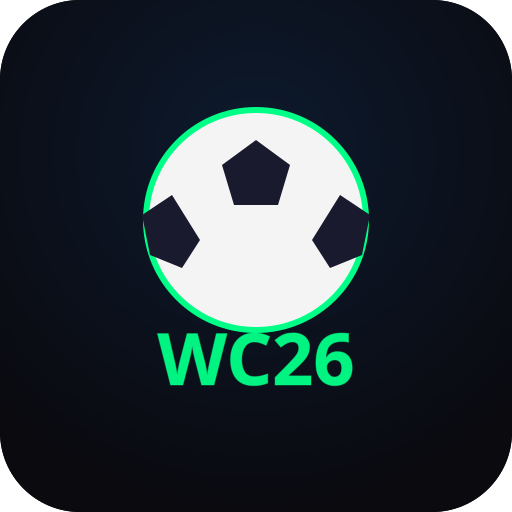

<div align="center">



# ⚽ Quiniela WC 2026

**Predice · Compite · Gana**

Aplicación web corporativa para el **FIFA World Cup 2026**
USA · Canadá · México — 11 jun al 19 jul 2026

[](https://qwc-2026.vercel.app)
[](https://supabase.com)
[](https://react.dev)
[](https://vitejs.dev)
[](.)

[🌐 Ver App](https://qwc-2026.vercel.app) · [📋 Ficha Técnica](FICHA_TECNICA.md) · [🐛 Reportar Bug](https://github.com/GianfrancoMongiell0/QWC2026/issues)

</div>

---

## 📸 Vista previa

```
┌─────────────────────────────────────────┐
│  WC26 ⚽              ⚙️ Admin  M  Salir  │
├─────────────────────────────────────────┤
│                                         │
│  QUINIELA                               │
│  WC 2026  ← (neón verde)               │
│                                         │
│  ┌─────────────┬─────────────────────┐  │
│  │ Iniciar     │   Crear Cuenta      │  │
│  │ Sesión  ●   │                     │  │
│  └─────────────┴─────────────────────┘  │
│                                         │
│  EMAIL                                  │
│  ┌─────────────────────────────────┐   │
│  │ tu@empresa.com                  │   │
│  └─────────────────────────────────┘   │
│                                         │
│  ┌─────────────────────────────────┐   │
│  │    ⚽  Entrar al Mundial        │   │
│  └─────────────────────────────────┘   │
└─────────────────────────────────────────┘
```

---

## ✨ Características

| Función | Descripción |
|---------|-------------|
| 🏆 **Ligas privadas** | Crea ligas con código de invitación y compite con tus compañeros |
| ⚽ **72 partidos de grupos** | Predice el marcador exacto de todos los partidos |
| 🔮 **Bracket eliminatorio** | Se autocompleta desde tus predicciones de grupos |
| 🥅 **Predicción de penales** | En eliminatoria, predice quién gana si hay empate |
| ⭐ **Puntos automáticos** | El sistema calcula y asigna puntos sin intervención manual |
| 📊 **Tabla en tiempo real** | Posiciones actualizadas vía Supabase Realtime |
| 📱 **PWA instalable** | Funciona como app nativa en móvil y escritorio |
| 🔒 **Anti-trampa** | Doble bloqueo frontend + BD el 11 de junio |
| 📤 **Compartir** | Invita por WhatsApp con un toque |

---

## 🏗️ Stack Tecnológico

```
Frontend          Backend           Hosting
─────────         ───────           ───────
React 18      →   Supabase          Vercel
Vite 5            PostgreSQL        CDN Global
Tailwind CSS      Supabase Auth     CI/CD automático
React Router      Supabase Realtime
PWA               Row Level Security
```

---

## 🎨 Diseño

Paleta de colores oficial WC 2026 — **neón sobre negro**:

| Color | Hex | Uso |
|-------|-----|-----|
| 🟢 Verde neón | `#00FF87` | Logo, éxito, activo |
| 🔵 Azul eléctrico | `#00D4FF` | Hover, info |
| 🟣 Morado | `#8B5CF6` | Penales, bracket |
| 🔴 Rojo | `#FF3366` | Error, cerrado |
| 🟡 Dorado | `#FFD700` | Puntos, admin |

---

## ⭐ Sistema de Puntos

```
Marcador exacto (2-1 predices, 2-1 termina)        → ⭐ 3 pts
Empate exacto + penales correctos                   → ⭐ 3 pts
Tendencia correcta (predices ganador acertado)      → ✓  2 pts
Empate exacto + penales incorrectos                 → ✓  2 pts
Fallo                                               → ✗  0 pts
```

Los puntos se calculan **automáticamente** via trigger de PostgreSQL cuando el admin ingresa el resultado oficial.

---

## 🚀 Instalación

### Requisitos
- Node.js 18+
- Cuenta en [Supabase](https://supabase.com)
- Cuenta en [Vercel](https://vercel.com)

### 1. Clonar e instalar
```bash
git clone https://github.com/GianfrancoMongiell0/QWC2026.git
cd QWC2026
npm install
```

### 2. Variables de entorno
```bash
cp .env.example .env.local
```
```env
VITE_SUPABASE_URL=https://tu-proyecto.supabase.co
VITE_SUPABASE_ANON_KEY=tu_anon_key
```

### 3. Configurar Supabase Auth
```
Authentication → Providers → Email
→ Confirm email: OFF
→ Allow new users: ON
```

### 4. Ejecutar SQLs en Supabase
```bash
# En Supabase SQL Editor, ejecutar en orden:
supabase/01_schema.sql
supabase/02_rls.sql
supabase/03_matches_wc2026.sql
supabase/04_grupos_I_L.sql
supabase/05_knockout_official.sql
supabase/06_fix_predictions_per_league.sql
supabase/07_penalty_winner.sql
supabase/08_user_penalty_prediction.sql
```

### 5. Dar permisos de admin
```sql
UPDATE public.users_profiles
SET role = 'admin'
WHERE username = 'tu_username';
```

### 6. Desarrollo local
```bash
npm run dev
# → http://localhost:5173
```

---

## 📦 Despliegue en Vercel

```bash
# 1. Subir a GitHub
git add .
git commit -m "🚀 Initial commit"
git push

# 2. En vercel.com → Add New Project → importar repo
# 3. Agregar variables de entorno VITE_SUPABASE_URL y VITE_SUPABASE_ANON_KEY
# 4. Deploy ✅
```

Después del deploy, actualizar en Supabase:
```
Authentication → URL Configuration
→ Site URL: https://tu-app.vercel.app
→ Redirect URLs: https://tu-app.vercel.app/**
```

---

## 📁 Estructura del Proyecto

```
quiniela-wc2026/
├── public/
│   ├── manifest.json          # PWA
│   ├── sw.js                  # Service Worker
│   └── icons/                 # Iconos PWA
├── src/
│   ├── context/               # AuthContext
│   ├── hooks/                 # useLeague, useMatches, usePredictions...
│   ├── pages/                 # Landing, Dashboard, League, Admin
│   ├── components/            # UI components
│   └── utils/                 # bracketResolver, dateHelpers
├── supabase/                  # Scripts SQL
├── vercel.json                # SPA routing
└── .env.example
```

---

## 🔐 Seguridad

- **RLS** habilitado en todas las tablas
- **Doble bloqueo** de predicciones: frontend + PostgreSQL
- **Roles** de usuario: `user` y `admin`
- **JWT** con auto-refresh via Supabase Auth
- El admin es el **único** que puede modificar resultados de partidos

---

## 📊 Base de Datos

```
auth.users (Supabase)
    │
    └──► users_profiles
              │
              ├──► league_members ◄──── leagues
              │                              │
              └──► predictions ◄─────── matches
```

**5 tablas · 4 funciones SQL · 2 triggers · 104 partidos pre-cargados**

---

## ⚙️ Scripts

```bash
npm run dev      # Desarrollo → localhost:5173
npm run build    # Build de producción
npm run preview  # Preview del build
```

---

## 📅 Calendario importante

| Fecha | Evento |
|-------|--------|
| Antes del 11 jun | Los usuarios predicen libremente |
| **10 jun 2026** | ⚠️ Desactivar nuevos registros en Supabase Auth |
| **11 jun 2026** | 🔒 Predicciones bloqueadas automáticamente |
| 11 jun – 19 jul | Admin ingresa resultados, puntos se calculan solos |
| **19 jul 2026** | 🏆 Final del Mundial — ranking definitivo |

---

## 🤝 Contribución

Este es un proyecto privado corporativo. Para reportar bugs o sugerir mejoras, abre un [Issue](https://github.com/GianfrancoMongiell0/QWC2026/issues).

---

<div align="center">

Desarrollado con ❤️ para el **FIFA World Cup 2026**

⚽ **USA · CAN · MEX · 11 jun – 19 jul 2026** ⚽

</div>